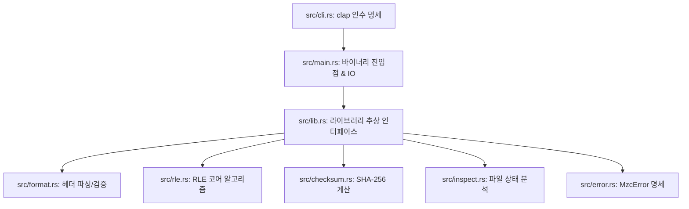

# MZC (Minimal Zip Concept)

MZC는 Rust 학습과 압축 알고리즘 작동 원리의 이해를 병행하기 위해 직접 설계한 무손실 압축 포맷 및 CLI 도구입니다.
상용 압축 알고리즘(ZIP, Zstandard, Brotli 등)을 능가하는 것이 목표가 아니라, 바이트 정합성과 무손실 복원의 원리를 명확하게 구현하여 학습하는 데 초점을 맞추었습니다.

현재 완성된 마일스톤은 **MZC1** 포맷으로, **블록 기반 RLE(Run-Length Encoding) 알고리즘**을 활용하며 데이터 정합성 검증을 위해 **SHA-256 해시**를 결합하여 구현되었습니다.

---

## 1. MZC1 파일 포맷 명세

MZC1 압축 파일은 **54바이트 고정 크기의 파일 헤더**와 뒤이은 **가변 크기의 압축 페이로드 블록(Payload Blocks)**의 조합으로 구성됩니다.

### 1.1 파일 헤더 레이아웃 (Fixed 54 Bytes)

| 필드명 (Field) | 크기 (Size) | 타입 (Type) | 고정값 / 설명 (Description) |
| :--- | :---: | :---: | :--- |
| **Magic Header** | 4 bytes | ASCII | 반드시 `"MZC1"` 문자열이어야 함 |
| **Version** | 1 byte | u8 | `0x01` (버전 1) |
| **Algorithm Type** | 1 byte | u8 | `0x01` (RLE 압축 방식 지정) |
| **Original Size** | 8 bytes | u64 | 원본 파일의 원래 크기 (Little-Endian) |
| **Payload Size** | 8 bytes | u64 | 압축된 페이로드만의 크기 (Little-Endian) |
| **Original SHA-256** | 32 bytes | bytes | 원본 파일 전체에 대한 SHA-256 해시값 (복원 무결성 검증용) |

### 1.2 페이로드 블록 구조 (Payload Blocks)

페이로드 영역은 아래 2가지 타입의 블록이 체인 형태로 연속되어 나열됩니다. 모든 블록의 크기(`u16`)는 **최대 65,535바이트**로 제한되며, 연속된 데이터가 이보다 클 경우 안전하게 여러 개의 블록으로 분할(Split)됩니다.

#### [Type 0x00] Literal Block (비압축 데이터 영역)
동일 바이트가 4회 이상 연속되지 않는 불규칙한 데이터를 그대로 담습니다.
* **Block Type** (1 byte): `0x00`
* **Length** (2 bytes, `u16` Little-Endian): 저장된 데이터 바이트 길이 $N$ (최대 65,535)
* **Data** ($N$ bytes): 실제 원본 데이터 흐름

#### [Type 0x01] Run Block (압축 데이터 영역)
동일 바이트가 4회 이상 연속되는 반복 패턴을 압축하여 담습니다.
* **Block Type** (1 byte): `0x01`
* **Count** (2 bytes, `u16` Little-Endian): 바이트 반복 횟수 (최대 65,535)
* **Value** (1 byte): 반복되는 바이트 값

---

## 2. 빌드 및 설치 방법

이 도구는 Rust 도구 체인(`cargo`)을 사용하여 손쉽게 빌드할 수 있습니다.

### 사전 요구사항
* [Rust 및 Cargo 설치](https://www.rust-lang.org/tools/install) (Rust 1.56+ 혹은 Edition 2021 지원 버전)

### 컴파일
프로젝트 루트 디렉토리에서 아래 명령어를 실행합니다.

```bash
# 릴리즈 빌드 (최적화 적용 빌드, target/release/mzc 생성)
cargo build --release
```

윈도우 시스템에서는 `target/release/mzc.exe`가 생성되며, 리눅스/맥OS에서는 `target/release/mzc` 바이너리가 생성됩니다.

---

## 3. CLI 사용법 및 실제 명령어 작동 가이드

빌드된 `mzc` 실행 파일은 총 4가지 핵심 서브커맨드를 지원합니다. 빌드된 실행 파일이나 `cargo run --` 명령을 통해 즉시 동작할 수 있습니다.

### 3.1 파일 압축 (`compress`)
원본 파일을 읽고 MZC1 규격에 맞추어 RLE 압축 파일로 저장합니다.

* **개발용 실행:**
  ```bash
  cargo run -- compress samples/repeated.txt samples/repeated.mzc
  ```
* **실제 컴파일된 바이너리로 실행 (Windows):**
  ```cmd
  .\target\release\mzc.exe compress samples\repeated.txt samples\repeated.mzc
  ```
* **실제 컴파일된 바이너리로 실행 (Linux / macOS):**
  ```bash
  ./target/release/mzc compress samples/repeated.txt samples/repeated.mzc
  ```

### 3.2 파일 압축 해제 (`decompress`)
MZC1 압축 파일을 해제하여 원본 상태로 복원합니다. 복원 과정에서 **SHA-256 해시 검증**을 수행하여 1바이트라도 유실 또는 오염될 경우 에러를 발생시킵니다.

* **개발용 실행:**
  ```bash
  cargo run -- decompress samples/repeated.mzc samples/repeated.restored.txt
  ```
* **실제 바이너리 실행:**
  ```bash
  ./target/release/mzc decompress samples/repeated.mzc samples/repeated.restored.txt
  ```

### 3.3 메타데이터 및 상태 분석 (`inspect`)
압축 파일을 풀지 않고 헤더 정보를 읽어 포맷 정보, 압축률, 내장된 원본 SHA-256 해시를 상세히 표시하며, **내부 페이로드를 검산하여 데이터 무결성을 검증**합니다.

* **개발용 실행:**
  ```bash
  cargo run -- inspect samples/repeated.mzc
  ```
* **실제 바이너리 실행:**
  ```bash
  ./target/release/mzc inspect samples/repeated.mzc
  ```

* **출력 예시:**
  ```text
  File: "repeated.mzc"
  Format: MZC1 (Minimal Zip Concept v1)
  Algorithm: RLE (Run-Length Encoding)
  Original size: 8100 bytes
  Compressed size: 854 bytes
  Ratio: 10.54%
  SHA-256: b739ba55633a9e232a885999120fcb3db03e670f291b184fab92cd504c41ab70
  Verified: OK
  ```

### 3.4 메모리 상의 고속 라운드트립 테스트 (`test`)
지정한 원본 파일을 디스크 쓰기 없이 임시 메모리 버퍼 상에서 압축 및 즉시 압축 해제하여 무손실 동작을 신속하게 검사합니다.

* **개발용 실행:**
  ```bash
  cargo run -- test samples/repeated.txt
  ```
* **실제 바이너리 실행:**
  ```bash
  ./target/release/mzc test samples/repeated.txt
  ```

* **출력 예시:**
  ```text
  라운드트립 자가 검증 테스트 시작: "samples/repeated.txt"
  Original size: 8100 bytes
  Compressed size: 854 bytes
  Ratio: 10.54%
  SHA-256: b739ba55633a9e232a885999120fcb3db03e670f291b184fab92cd504c41ab70
  Verified: OK
  ```

---

## 4. 학습용 아키텍처 디자인

이 프로젝트는 초보자가 Rust의 모듈 시스템과 패키지 레이아웃을 학습하기에 최적의 클린 아키텍처 구조를 띄고 있습니다.



* **`src/lib.rs` (추상 인터페이스 제공)**:
  `compress_bytes(original: &[u8]) -> Vec<u8>` 및 `decompress_bytes(mzc: &[u8]) -> Result<Vec<u8>, MzcError>` 와 같은 독립적인 라이브러리 파이프라인을 노출하여, 파일 IO를 완전히 배제한 순수 비즈니스 로직 단위의 엄격한 통합 테스트와 단순하고 맑은 소스코드를 구현하였습니다.
