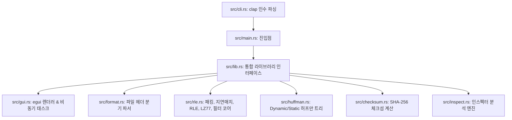

# MZC (Minimal Zip Concept)

MZC는 Rust 학습과 압축 알고리즘 작동 원리의 이해를 병행하기 위해 직접 설계한 무손실 압축 포맷 및 CLI/GUI 도구입니다.
상용 압축 알고리즘(ZIP, Zstandard, Brotli 등)을 능가하는 것이 목표가 아니라, 바이트 정합성과 무손실 복원의 원리를 명확하게 구현하고 점진적인 포맷 고도화 단계를 실습하는 데 초점을 맞추었습니다.

👉 **[MZC GitHub Pages 랜딩 페이지 바로가기](https://jeiel85.github.io/minimal-zip-concept/)**

---

## 1. MZC 아키텍처 및 마일스톤 변천사 (MZC1 ~ MZC5)

MZC는 단순한 RLE 압축기로 시작하여 최상위 비트 레벨 패킹 사양까지 점진적으로 진화해  왔습니다.

### 1.1 MZC1 (Retro RLE Spec)
- **알고리즘**: 단순 Run-Length Encoding
- **헤더 규격**: 54바이트 고정 헤더
- **동작**: 연속적으로 4번 이상 반복되는 바이트 흐름을 `Value`와 `Count` 조합으로 단순 기록. 데이터의 비압축 불규칙 흐름은 `Literal Block`으로 처리.

### 1.2 MZC2 (Parallel Dictionary Spec)
- **알고리즘**: Dictionary Hybrid + Rayon 멀티스레드 병렬화
- **헤더 규격**: 56바이트 고정 헤더 (사전 테이블 크기 정보 2바이트 추가)
- **동작**: 파일을 1MB 청크 단위로 나누어 멀티스레드로 각 스레드에서 병렬 압축. 자주 등장하는 바이트 시퀀스를 사전에 수집하여 토큰 인덱스로 대치 압축.

### 1.3 MZC3 (Sliding Window Chunk Spec)
- **알고리즘**: LZ77 + Huffman (정적 허프만 코딩)
- **동작**: 32KB 크기 슬라이딩 윈도우 룩어헤드 내에서 이전 데이터와의 중복 영역을 감지하여 거리(Distance)와 길이(Length) 정보의 백레퍼런스로 코딩. 압축 효율 향상을 위해 정적 허프만 부호화를 2차 결합.

### 1.4 MZC4 (Dynamic Huffman Spec)
- **알고리즘**: Canonical Dynamic Huffman Tree
- **동작**: 1KB 크기 이상의 정적 트리 헤더 오버헤드를 타파하기 위해, 실제 청크 파일에서 출현한 기호 빈도를 기준하여 Canonical Tree를 동적 생성. 트리의 코드길이 정보 자체를 Tree RLE 압축으로 묶어 단 20~40바이트의 초슬림 헤더를 실현.

### 1.5 MZC5 (Bit-Packed Spec & Preprocessors)
- **알고리즘**: 🪙 비트 레벨 플래그 패킹 + ⚡ 지연 매칭 + 🎹 BCJ / Delta 전처리 필터
- **동작**:
  - **Bit-level Stream Packing**: 블록마다 붙던 1바이트 접두사 타입 바이트를 전면 폐기하고, 압축 요소 8개씩 묶어 2바이트(16비트, 2비트 x 8) 플래그 스트림으로 직렬화하여 오버헤드 15~25% 감소.
  - **Lazy Matching**: 그리디(Greedy) 방식 LZ77 탐색을 우회하여, 한 바이트 진행한 오프셋에서 더 긴 일치 항목이 출현할 시 현재 바이트는 리터럴로 보내고 더 긴 일치 정보를 인코딩.
  - **Delta Preprocessor**: Wav, Bmp 등 인접 파형/바이트 간 차분값 계산으로 정보 엔트로피를 물리적으로 축소.
  - **BCJ Preprocessor**: x86 바이너리의 Jump/Call 명령 상대 주소를 절대 주소로 대치 대칭시켜 데이터 반복률 유도.
  - **Decompression Safety Verification**: 데이터 복원 시 유해한 깨진 데이터 오염이 발생하더라도 디코더에서 임의 크기 벡터 할당 및 인덱스 월경을 즉시 감지하여 차단하는 안전망 내장.

---

## 2. GUI 실시간 모니터 대시보드 탑재

`egui` 및 `egui_plot`을 이용한 화려한 시각적 GUI 성능 진단 화면을 제공합니다.
- **Rayon Thread Occupancy Gauge**: 압축 연산 시 내부 스레드 코어의 점유율 상태를 백분율 프로그레스바로 시각화.
- **실시간 Throughput/Ratio Curves**: 1MB 청크가 처리될 때마다 실시간 압축 속도(MB/s) 및 압축률(%) 곡선을 꺾은선으로 렌더링.
- **물리적 이진 그리드 맵**: 복원된 RLE, 토큰, 백레퍼런스, 리터럴 블록의 기하학적 분포를 캔버스상에 색상 그리드로 매핑.

---

## 3. 설치 및 빌드 방법

### 3.1 사전 요구사항
- [Rust 및 Cargo 도구 체인 설치](https://www.rust-lang.org/tools/install) (Edition 2021 지원)

### 3.2 빌드
```bash
# 릴리즈 실행 파일 컴파일 (target/release/mzc 생성)
cargo build --release
```

---

## 4. 실제 명령어 가이드

MZC 엔진은 서브커맨드 기반 CLI 명령과 GUI 단독 실행 모드를 지원합니다.

### 4.1 CLI 압축 (`compress`)
```bash
# MZC5 최상위 레벨 압축 실행 (레벨 9, Delta 전처리 활성화, BCJ 전처리 활성화)
./target/release/mzc compress input_file.bin output_file.mzc5 -m lz77 -e dynamic -l 9 --delta --bcj
```

### 4.2 CLI 압축 해제 (`decompress`)
```bash
# SHA-256 검증 및 자동 버전/필터 식별 디코딩 복원
./target/release/mzc decompress output_file.mzc5 restored_file.bin
```

### 4.3 CLI 파일 검사 및 상세 정보 진단 (`inspect`)
```bash
./target/release/mzc inspect output_file.mzc5
```

### 4.4 데스크톱 GUI 진단 대시보드 기동 (`gui`)
```bash
./target/release/mzc gui
# 또는 cargo run -- gui
```

---

## 5. 학습용 설계 아키텍처

MZC는 모듈 간의 의존성이 명확하여 Rust의 에러 핸들링, 비트 스트림 다루기, GUI 및 멀티스레딩 학습에 훌륭한 길잡이가 됩니다.


