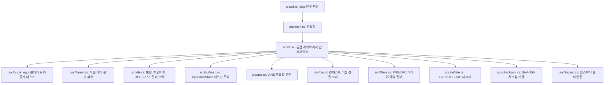

# MZC (Minimal Zip Concept)

MZC는 Rust 학습과 압축 알고리즘 작동 원리의 이해를 병행하기 위해 직접 설계한 무손실 압축 포맷 및 CLI/GUI 도구입니다.
상용 압축 알고리즘(ZIP, Zstandard, Brotli 등)을 능가하는 것이 목표가 아니라, 바이트 정합성과 무손실 복원의 원리를 명확하게 구현하고 점진적인 포맷 고도화 단계를 실습하는 데 초점을 맞추었습니다.

👉 **[MZC GitHub Pages 랜딩 페이지 바로가기](https://jeiel85.github.io/minimal-zip-concept/)**

---

## 1. MZC 아키텍처 및 마일스톤 변천사 (MZC1 ~ MZC7)

MZC는 단순한 RLE 압축기로 시작하여 최상위 비트 레벨 패킹 및 컨텍스트 믹싱 사양까지 점진적으로 진화해 왔습니다.

### 1.1 MZC1 (Retro RLE Spec)
- **알고리즘**: 단순 Run-Length Encoding
- **헤더 규격**: 54바이트 고정 헤더
- **동작**: 연속적으로 4번 이상 반복되는 바이트 흐름을 `Value`와 `Count` 조합으로 단순 기록. 데이터의 비압축 불규칙 흐름은 `Literal Block`으로 처리.

### 1.2 MZC2 (Parallel Dictionary Spec)
- **알고리즘**: Dictionary Hybrid + Rayon 멀티스레드 병렬화
- **헤더 규격**: 56바이트 고정 헤더 (사전 테이블 크기 정보 2바이트 추가)
- **동작**: 파일을 1MB 청크 단위로 나누어 멀티스레드로 각 스레드에서 병렬 압축. 자주 등장하는 바이트 시퀀스를 사전에 수집하여 토큰 인덱스로 대치 압축.

### 1.3 MZC3 (Sliding Window Chunk Spec)
- **알고리즘**: LZ77 + Huffman (정적 허프만 코딩)
- **동작**: 32KB 크기 슬라이딩 윈도우 룩어헤드 내에서 이전 데이터와의 중복 영역을 감지하여 거리(Distance)와 길이(Length) 정보의 백레퍼런스로 코딩. 압축 효율 향상을 위해 정적 허프만 부호화를 2차 결합.

### 1.4 MZC4 (Dynamic Huffman Spec)
- **알고리즘**: Canonical Dynamic Huffman Tree
- **동작**: 1KB 크기 이상의 정적 트리 헤더 오버헤드를 타파하기 위해, 실제 청크 파일에서 출현한 기호 빈도를 기준하여 Canonical Tree를 동적 생성. 트리의 코드길이 정보 자체를 Tree RLE 압축으로 묶어 단 20~40바이트의 초슬림 헤더를 실현.

### 1.5 MZC5 (Bit-Packed Spec & Preprocessors)
- **알고리즘**: 🪙 비트 레벨 플래그 패킹 + ⚡ 지연 매칭 + 🎹 BCJ / Delta 전처리 필터
- **동작**:
  - **Bit-level Stream Packing**: 블록마다 붙던 1바이트 접두사 타입 바이트를 전면 폐기하고, 압축 요소 8개씩 묶어 2바이트(16비트, 2비트 x 8) 플래그 스트림으로 직렬화하여 오버헤드 15~25% 감소.
  - **Lazy Matching**: 그리디(Greedy) 방식 LZ77 탐색을 우회하여, 한 바이트 진행한 오프셋에서 더 긴 일치 항목이 출현할 시 현재 바이트는 리터럴로 보내고 더 긴 일치 정보를 인코딩.
  - **Delta Preprocessor**: Wav, Bmp 등 인접 파형/바이트 간 차분값 계산으로 정보 엔트로피를 물리적으로 축소.
  - **BCJ Preprocessor**: x86 바이너리의 Jump/Call 명령 상대 주소를 절대 주소로 대치 대칭시켜 데이터 반복률 유도.
  - **Decompression Safety Verification**: 데이터 복원 시 유해한 깨진 데이터 오염이 발생하더라도 디코더에서 임의 크기 벡터 할당 및 인덱스 월경을 즉시 감지하여 차단하는 안전망 내장.

### 1.6 MZC6 (Asymmetric Numeral Systems & Shared Dictionaries Spec)
- **알고리즘**: Asymmetric Numeral Systems (tANS) + LZ77 Hash Chains + Global Shared Dictionary
- **헤더 규격**: 56바이트 고정 헤더 (사전 크기 필드 재활용)
- **동작**:
  - **LZ77 Hash Chains**: 선형 탐색 대신 65,536개 크기의 해시 테이블을 도입하여 3바이트 접두사의 매칭 체인을 뒤쫓는 방식으로 $O(limit)$ 매칭 스캔 달성.
  - **tANS (Table-based Asymmetric Numeral Systems)**: Huffman 코딩의 1비트 한계를 돌파하여 분수 비트 단위의 엔트로피 압축을 수행하는 최첨단 ANS 압축 엔진 내장 (`src/ans.rs`).
  - **Global Shared Dictionary**: 개별 청크 내 사전을 중복 직렬화하지 않고, 파일 헤더 직후에 1회만 내장하여 공유하도록 개선.
  - **Dictionary Training**: 여러 샘플 데이터셋으로부터 공통 바이트 시퀀스를 빌드하여 `.dict` 형태의 공유 사전을 사전 학습(Training)할 수 있는 CLI 기능 추가.

### 1.7 MZC7 (Context Mixing & Media Filters Spec - 최신 사양)
- **알고리즘**: 🧠 컨텍스트 믹싱 레인지 코더 (CM) + 🖼️ PNG Paeth 필터 + 🎧 LPC 오디오 필터 + ⚡ GZIP/DEFLATE 디코더
- **헤더 규격**: 56바이트 고정 헤더 (MZC7 전용 비트 패킹 플래그 적용)
- **동작**:
  - **Context Mixing Range Coder**: 직전 비트 문맥을 0차, 1차, 2차(해시 직접 매핑)로 분할 분석하여 가중치 평균(1:2:5)으로 섞어 확률을 예측하고, 실수 하위 구간을 쪼개는 산술 레인지 코더를 결합하여 압축합니다 (`src/cm.rs`).
  - **PNG Paeth Filter**: 이미지 픽셀 간의 2차원 공간적 중복성을 줄이기 위한 Paeth 그라디언트 예측 필터를 전처리로 적용합니다.
  - **LPC Audio Filter**: 16비트 PCM 오디오 신호의 인접 시퀀스 흐름을 2차 선형 예측(Order-2 LPC)하여 그 잔차(Residual) 차분만 압축하도록 변환합니다.
  - **RFC 1951/1952 DEFLATE & GZIP 디코더**: 표준 GZIP 형식 파일의 압축을 해제하여 원본 데이터를 복원해주는 디코더 모듈을 순수 Rust로 구현했습니다 (`src/deflate.rs`).

---

## 2. GUI 다중 탭 대시보드 탑재

`egui` 및 `egui_plot`을 이용한 화려한 시각적 GUI 성능 진단 화면을 제공하며, 상단 탭을 통해 모드를 전환할 수 있습니다.
- **Dashboard 탭**: 
  - **Rayon Thread Occupancy Gauge**: 압축 연산 시 내부 스레드 코어의 점유율 상태를 백분율 프로그레스바로 시각화.
  - **실시간 Throughput/Ratio Curves**: 1MB 청크가 처리될 때마다 실시간 압축 속도(MB/s) 및 압축률(%) 곡선을 렌더링.
  - **물리적 이진 그리드 맵**: 복원된 RLE, 토큰, 백레퍼런스, 리터럴 블록의 기하학적 분포를 캔버스상에 색상 그리드로 매핑.
- **Trainer 탭**: 다수의 텍스트나 데이터를 로드하여 다용도 공유 사전(`.dict`)을 클릭 몇 번으로 쉽게 자동 학습하고 내보낼 수 있는 시각적 트레이너 위저드.
- **tANS Plot 탭**: tANS 알고리즘 동작 중 입력 기호에 따른 상태 전이(State Transition) 과정을 애니메이션 기하학적 좌표 노드 플롯으로 렌더링 시뮬레이션.

---

## 3. 설치 및 빌드 방법

### 3.1 사전 요구사항
- [Rust 및 Cargo 도구 체인 설치](https://www.rust-lang.org/tools/install) (Edition 2021 지원)

### 3.2 빌드
```bash
# 릴리즈 실행 파일 컴파일 (target/release/mzc 생성)
cargo build --release
```

---

## 4. 실제 명령어 가이드

MZC 엔진은 서브커맨드 기반 CLI 명령과 GUI 단독 실행 모드를 지원합니다.

### 4.1 CLI 압축 (`compress`)
```bash
# MZC5 최상위 레벨 압축 실행 (레벨 9, Delta 전처리 활성화, BCJ 전처리 활성화)
./target/release/mzc compress input_file.bin output_file.mzc5 -m lz77 -e dynamic -l 9 --delta --bcj

# MZC6 tANS 및 사전 파일을 사용한 압축 실행
./target/release/mzc compress input_file.bin output_file.mzc6 -m lz77 -e ans -l 6 --dict-file trained.dict

# MZC7 컨텍스트 믹싱 및 PNG 필터를 사용한 압축 실행
./target/release/mzc compress input_image.png output_file.mzc7 -m hybrid -e cm --png
```

### 4.2 CLI 압축 해제 (`decompress`)
```bash
# SHA-256 검증 및 자동 버전/필터 식별 디코딩 복원 (내장 전역 사전 자동 추출)
./target/release/mzc decompress output_file.mzc7 restored_file.bin

# 외부 사전을 지정하여 해제하는 경우 (옵션)
./target/release/mzc decompress output_file.mzc6 restored_file.bin --dict-file trained.dict
```

### 4.3 CLI GZIP 압축 해제 (`inflate`)
```bash
# 표준 GZIP 포맷(.gz) 파일의 압축을 해제하여 복원
./target/release/mzc inflate archive.gz restored_file.txt
```

### 4.4 CLI 사전 학습 (`train`)
```bash
# 다수의 샘플 파일들로부터 공통 패턴을 수집하여 trained.dict 파일로 학습 저장
./target/release/mzc train samples/*.txt -o trained.dict
```

### 4.5 CLI 파일 검사 및 상세 정보 진단 (`inspect`)
```bash
./target/release/mzc inspect output_file.mzc7
```

### 4.6 데스크톱 GUI 진단 대시보드 기동 (`gui`)
```bash
./target/release/mzc gui
# 또는 cargo run -- gui
```

---

## 5. 학습용 설계 아키텍처

MZC는 모듈 간의 의존성이 명확하여 Rust의 에러 핸들링, 비트 스트림 다루기, GUI 및 멀티스레딩 학습에 훌륭한 길잡이가 됩니다.


