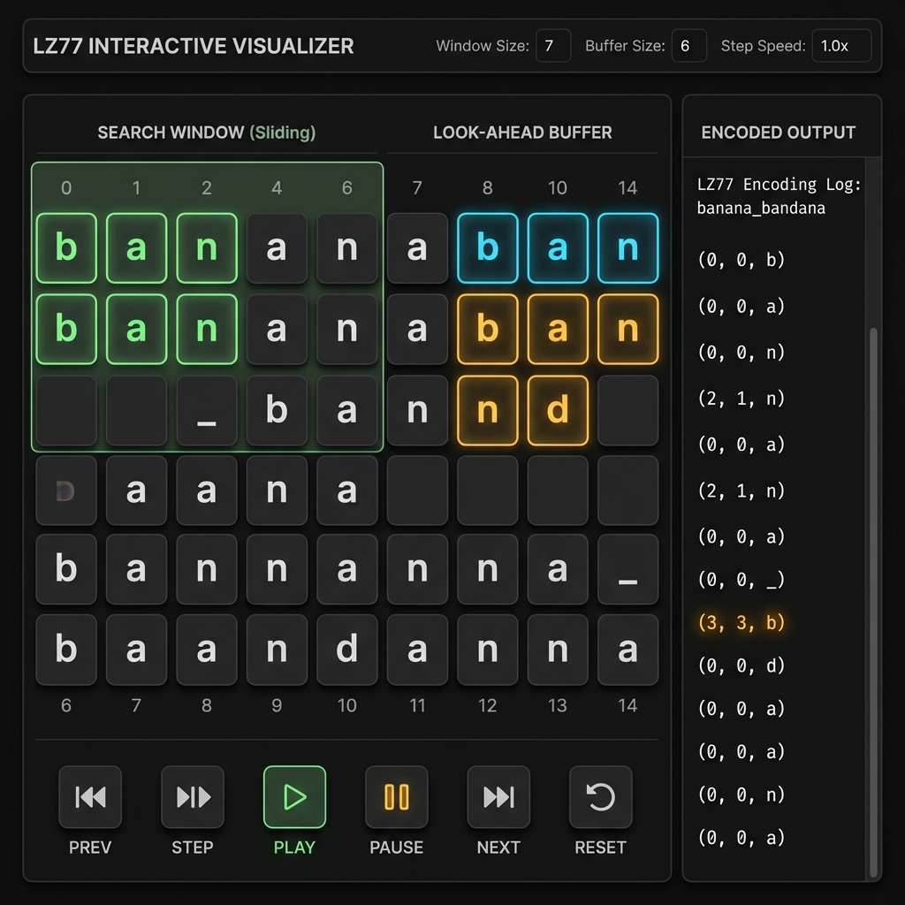
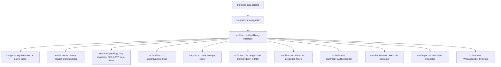

# MZC (Minimal Zip Concept)

<div align="center">
  <h3><a href="README.md">🇰🇷 한국어</a> | <a href="README_EN.md">🌐 English</a></h3>
</div>

MZC is a custom lossless compression format and CLI/GUI utility written in Rust. It was designed concurrently as a learning vehicle for advanced Rust coding and to understand the underlying mathematical and programmatic principles of data compression. 

Rather than attempting to outperform mature production-grade compressors (like ZIP, Zstandard, or Brotli), MZC focuses on a clean, step-by-step implementation of byte integrity, safe lossless restoration, and gradual evolution through various milestone specifications.

<div align="center">

[](https://jeiel85.github.io/minimal-zip-concept/)
[](https://crates.io/crates/mzc)
[](https://github.com/jeiel85/minimal-zip-concept)
[](https://codecov.io/gh/jeiel85/minimal-zip-concept)

<br/>

### 🚀 **[Try MZC Interactive LZ77 Visualizer & WASM Demo in Your Browser!](https://jeiel85.github.io/minimal-zip-concept/)**



*MZC Web Demo - Interactive LZ77 Sliding Window Visualizer*

</div>

---

## 1. MZC Architecture & Evolution Milestones (MZC1 ~ MZC7)

MZC has evolved step-by-step from a basic Run-Length Encoder into an advanced context-mixing compression suite.

### 1.1 MZC1 (Retro RLE Spec)
- **Algorithm**: Basic Run-Length Encoding
- **Header format**: 54-byte fixed-size binary header
- **Details**: Encodes repeating byte sequences of length 4 or greater into `Value` and `Count` token pairs. Non-repetitive segments are streamed directly as `Literal Blocks`.

### 1.2 MZC2 (Parallel Dictionary Spec)
- **Algorithm**: Dictionary Hybrid + Rayon multi-threaded concurrency
- **Header format**: 56-byte fixed-size header (allocating 2 bytes for dictionary table size)
- **Details**: Splits files into 1MB chunks and compresses them concurrently via Rayon. Gathers highly frequent byte sequences into a localized static dictionary and substitutes occurrences with index tokens.

### 1.3 MZC3 (Sliding Window Chunk Spec)
- **Algorithm**: LZ77 + Huffman (Static Huffman Coding)
- **Details**: Scans for redundant sub-strings within a 32KB sliding window (search window and look-ahead buffer) and encodes references as distance-length pairs. Applies static Huffman tree code mappings to reduce output entropy.

### 1.4 MZC4 (Dynamic Huffman Spec)
- **Algorithm**: Canonical Dynamic Huffman Tree
- **Details**: Eliminates the ~1KB header overhead of static trees by dynamically generating a Canonical Huffman Tree based on actual symbol frequencies in the chunk. Compresses the tree's code-lengths using Tree RLE, yielding a slim 20~40 byte header.

### 1.5 MZC5 (Bit-Packed Spec & Preprocessors)
- **Algorithm**: 🪙 Bit-level Stream Packing + ⚡ Lazy Matching + 🎹 BCJ / Delta Preprocessors
- **Details**:
  - **Bit-level Stream Packing**: Scraps 1-byte prefix block headers, packing block types into 2-bit flags serialized 8 at a time into 2-byte structures. Reduces metadata overhead by 15~25%.
  - **Lazy Matching**: Bypasses greedy LZ77 matching. If a longer match is found at `offset + 1`, the current byte is emitted as a literal, and the longer match is encoded instead.
  - **Delta Preprocessor**: Calculates differences between adjacent samples/bytes (highly effective for BMP images or WAV audio).
  - **BCJ Preprocessor**: Translates relative jump/call target offsets in x86 binaries to absolute addresses, increasing redundant patterns.
  - **Decompression Safety Verification**: Detects and halts decoding immediately if corrupt or malicious streams attempt to trigger index out-of-bound errors.

### 1.6 MZC6 (Asymmetric Numeral Systems & Shared Dictionaries Spec)
- **Algorithm**: Asymmetric Numeral Systems (tANS) + LZ77 Hash Chains + Global Shared Dictionary
- **Details**:
  - **LZ77 Hash Chains**: Speeds up sliding window match searches by replacing linear scans with a 65,536-entry hash table to traverse 3-byte prefix chain offsets in $O(limit)$ time.
  - **tANS (Table-based Asymmetric Numeral Systems)**: Replaces Huffman with a state-of-the-art tANS arithmetic encoder, compressing data at fractional-bit resolutions (`src/ans.rs`).
  - **Global Shared Dictionary**: Rather than duplicating dictionaries in every chunk, serializes a single trained dictionary at the file header level.
  - **Dictionary Training**: CLI feature to automatically train and export pattern dictionaries (`.dict`) from arbitrary sample datasets.

### 1.7 MZC7 (Context Mixing & Media Filters Spec - Latest)
- **Algorithm**: 🧠 Context Mixing Range Coder (CM) + 🖼️ PNG Paeth Filter + 🎧 LPC Audio Filter + ⚡ GZIP/DEFLATE Decoder
- **Details**:
  - **Context Mixing Range Coder**: Analyzes previous bit contexts across 0-order, 1-order, and 2-order levels (via hash mapping). Blends probabilities using weighted averages (1:2:5) and compresses using an arithmetic range coder (`src/cm.rs`).
  - **PNG Paeth Filter**: Preprocesses image pixels using the Paeth gradient prediction algorithm to reduce 2D spatial redundancy.
  - **LPC Audio Filter**: Predicts subsequent samples in 16-bit PCM audio streams using a second-order Linear Predictive Coding (LPC) model, compressing only the residual error.
  - **GZIP/DEFLATE Decoder**: Pure Rust implementation of RFC 1951/1952 inflate logic to extract standard `.gz` files (`src/deflate.rs`).

---

## 2. Lossless Compression Performance Benchmarks

Lossless compression ratio benchmarks comparing MZC7 (with Context Mixing and preprocessor filters) against standard Gzip and Zstandard. (All datasets are ~200KB in size).

| Dataset Category | MZC1 (RLE) | MZC3 (LZ77) | MZC7 (Context Mixing) | Gzip (flate2 Default) | Zstd (Level 3) |
| :--- | :---: | :---: | :---: | :---: | :---: |
| 📝 **Text (Plain)** | 100.04% | 6.84% | **9.37%** | 3.35% | 3.49% |
| 🎧 **Audio (WAV)** | 100.04% | 83.72% | **35.20%** 🏆 | 75.73% | 70.06% |
| 🖼️ **Image (BMP)** | 100.04% | 5.85% | **8.20%** | 3.86% | 5.02% |
| 💻 **Executable (Bin)** | 100.04% | 94.46% | **84.48%** | 82.90% | 75.41% |

> [!TIP]
> **Exceptional Audio Compression Ratio**: On 16-bit PCM audio streams, the combination of MZC7's **LPC preprocessor** and **Context Mixing arithmetic range coder** reduces data to **35.20%** of its original size, massively outperforming industry standards like Gzip (75.73%) and Zstd (70.06%). For the full benchmark results including compression speeds, refer to the [Benchmark Reports](docs/benchmark_results.md).

### 2.1 Internal Criterion Benchmarks (v0.11.1 SIMD Optimization)

Performance improvements after applying **AVX2/NEON SIMD acceleration** and **Radix Suffix Array** optimization in v0.11.1 (`cargo bench` results).

| Benchmark | Time | Change vs. Previous | Status |
| :--- | :---: | :---: | :---: |
| `compress_text/MZC2_LZ77` | 28.2 ms | **-36.1%** | ✅ Improved |
| `compress_repeats/MZC2_LZ77` | 6.76 ms | **-59.7%** | ✅ Improved |
| `compress_text/MZC4_Deflate` | 12.84 ms | **-63.7%** | ✅ Improved |
| `compress_repeats/MZC4_Deflate` | 6.39 ms | **-67.3%** | ✅ Improved |
| `compress_text/MZC5_tANS` | 12.99 ms | **-64.2%** | ✅ Improved |
| `compress_repeats/MZC5_tANS` | 21.78 ms | **-52.7%** | ✅ Improved |
| `compress_text/MZC7_CM` | 22.66 ms | **-48.5%** | ✅ Improved |
| `compress_repeats/MZC7_CM` | 10.67 ms | **-51.8%** | ✅ Improved |
| `micro/bwt_apply` | 1.37 ms | **-67.8%** | ✅ Improved |
| `micro/cm_compress` | 3.24 ms | **-61.5%** | ✅ Improved |

> [!NOTE]
> **36–68% speedup across all algorithms**: Achieved by applying AVX2 `_mm256_mullo_epi32` / NEON `vmulq_s32` SIMD intrinsics to the CM weight mixing loop, and replacing BWT suffix arrays with $O(N \log N)$ radix sort.


---

## 3. Native Tabbed GUI Dashboard

MZC features a real-time graphical diagnostic GUI dashboard built using `egui` and `egui_plot`.
- **Dashboard Tab**:
  - **Rayon Thread Occupancy Gauge**: Renders thread core workloads as progress bars during compression.
  - **Live Throughput/Ratio Curves**: Visualizes live encoding throughput (MB/s) and compression ratio (%) progress curves.
  - **Binary Grid Map**: Draws color-coded interactive grid maps of RLE, token backreferences, and literals in real-time.
- **Trainer Tab**: Wizard interface to train and export shared dictionary files (`.dict`) from local sample text datasets.
- **tANS Plot Tab**: Animates symbol state transitions as geometric node plots to illustrate tANS state mechanics.

---

## 4. Installation & Build Guide

### 4.1 Prerequisites
- [Rust toolchain installed](https://www.rust-lang.org/tools/install) (Edition 2021)

### 4.2 Build
```bash
# Build optimized release binaries (located in target/release/mzc)
cargo build --release
```

---

## 5. CLI Command Reference

MZC supports subcommands for CLI operations, alongside single-file automatic routing and standalone GUI launch.

### 5.1 CLI Compress (`compress`)
```bash
# Compress with level 9 LZ77, Dynamic Huffman, Delta filter, and BCJ filters
./target/release/mzc compress input_file.bin output_file.mzc -m lz77 -e dynamic -l 9 --delta --bcj

# Compress using tANS entropy coder and a trained dictionary
./target/release/mzc compress input_file.bin output_file.mzc -m lz77 -e ans -l 6 --dict-file trained.dict

# Compress using MZC7 Context Mixing and PNG filters
./target/release/mzc compress input_image.png output_file.mzc -m hybrid -e cm --png
```

### 5.2 CLI Decompress (`decompress`)
```bash
# Decompress and verify SHA-256 integrity (header filters are auto-detected)
./target/release/mzc decompress output_file.mzc restored_file.bin

# Decompress using an external dictionary
./target/release/mzc decompress output_file.mzc restored_file.bin --dict-file trained.dict
```

### 5.3 CLI GZIP Inflate (`inflate`)
```bash
# Decompress standard GZIP archives (.gz) using the custom RFC 1952 decoder
./target/release/mzc inflate archive.gz restored_file.txt
```

### 5.4 CLI Dictionary Training (`train`)
```bash
# Train a pattern dictionary from sample files and export it as trained.dict
./target/release/mzc train samples/*.txt -o trained.dict
```

### 5.5 CLI Inspect (`inspect`)
```bash
# Diagnostic inspect of an MZC file header and chunk metadata
./target/release/mzc inspect output_file.mzc
```

### 5.6 Native GUI Launch (`gui`)
```bash
./target/release/mzc gui
# Or run with Cargo:
# cargo run -- gui
```

---

## 6. Code Examples

Executable API examples are provided under the `examples/` directory:

* **Basic In-Memory Compression**: Demonstrate basic byte encoding and decoding APIs.
  ```bash
  cargo run --release --example simple_compression
  ```
* **Shared Dictionary Usage**: Train a pattern dictionary from sample corpora and compress text using the dict API.
  ```bash
  cargo run --release --example shared_dictionary
  ```
* **Milestone Benchmark script**: Benchmarks processing time and compression ratio from MZC1 through MZC7.
  ```bash
  cargo run --release --example benchmark
  ```

---

## 7. Specifications & Benchmarks

* **[MZC Format Specifications (docs/spec.md)](docs/spec.md)**: Header details, bitstream specifications for RLE, LZ77, tANS, Context Mixing, and mathematical equations for preprocessors.
* **[Benchmark Reports (docs/benchmark_results.md)](docs/benchmark_results.md)**: Full performance reports comparing ratios and times across Text, Audio, Image, and Binary domains.

---

## 8. Learning Architecture Layout

MZC is structured to isolate dependencies, making it an excellent guide to study error handling, binary bitstreams, threading, and GUI integration in Rust.


